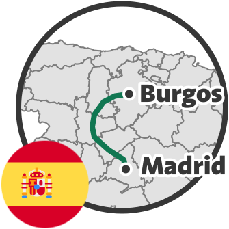
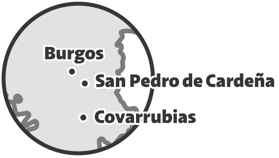

Burgos is the capital of the Burgos Province, in the Castilla y León Autonomous Community of Spain.

We took a train ride from Madrid to Burgos.
The train had intermediate stops at Segovia and Valladolid.



We also visited some places around Burgos, including the beautiful monastery of San Pedro de Cardeña and the small and the small and picturesque town of Covarrubias.