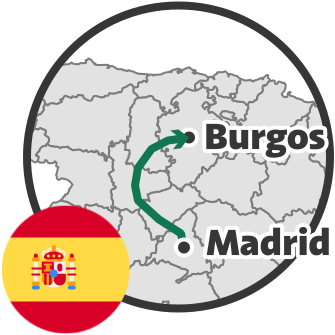

Burgos is the capital of the Burgos Province, in the Castilla y León Autonomous Community of Spain.

We took a train ride from Madrid to Burgos.
The train had intermediate stops at Segovia and Valladolid.
We arrived at the Burgos-Rosa Manzano station, which is quite far from the city center.
We spent two full days visiting the city of Burgos—the first and third ones of our trip.



On the first day, we visited the Cathedral and the Monastery of Santa María la Real de las Huelgas.
On the third day, we visited the Museum of Human Evolution, which exhibits artifacts from the nearby Atapuerca excavations, and the Cartuja of Santa María de Miraflores.

On the second day of our trip, we wanted to visit some of Burgos' surroundings.
We rented a car and drove to the beautiful monastery of San Pedro de Cardeña and to the small and picturesque town of Covarrubias.

