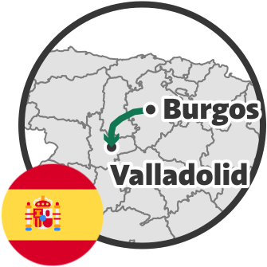

Valladolid is the capital of the Valladolid Province, in the Castilla y León Autonomous Community of Spain.

Continuing our trip to Burgos, we took a train ride from Burgos to Valladolid.
We spent a full day visiting the city.

